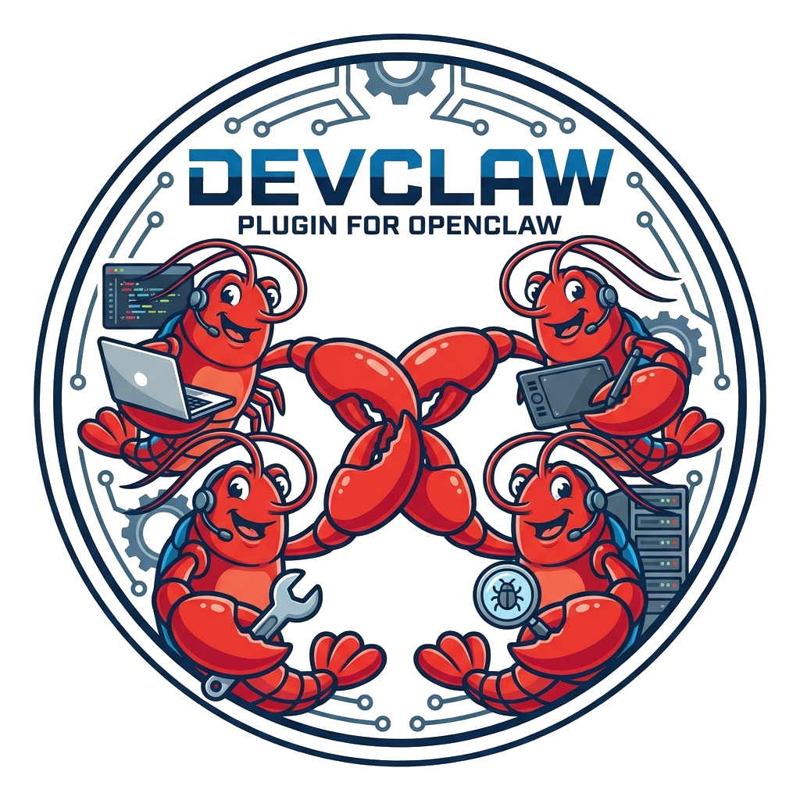
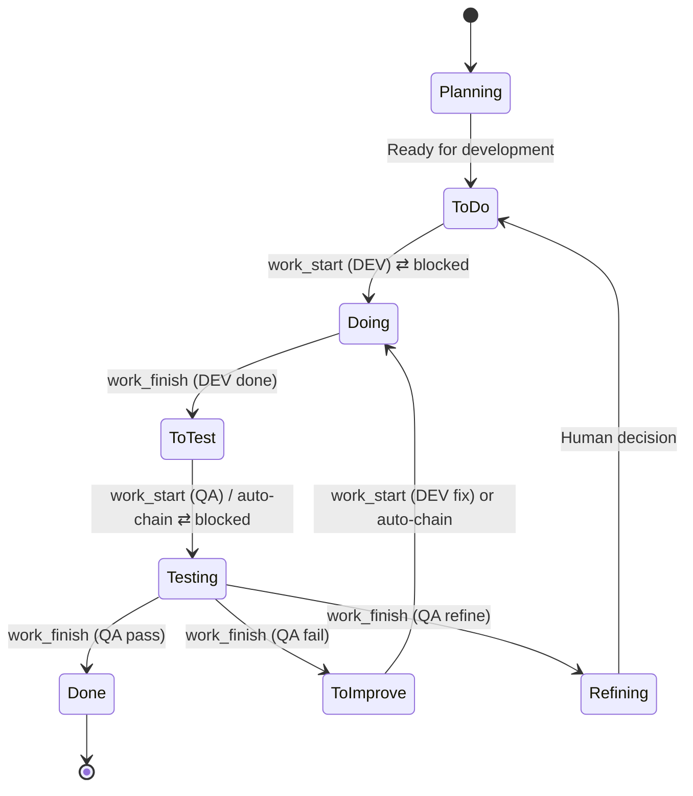

<p align="center">
  
</p>

# DevClaw — Development Plugin for OpenClaw

**Every group chat becomes an autonomous development team.**

Add an agent to a Telegram/WhatsApp group, point it at a GitHub/GitLab repo — that group now has an **orchestrator** managing the backlog, a **DEV** worker writing code, and a **QA** worker reviewing it. All autonomous. Add another group, get another team. Each project runs in complete isolation with its own task queue, workers, and session state.

DevClaw is the [OpenClaw](https://openclaw.ai) plugin that makes this work.

## Why DevClaw

OpenClaw gives you a powerful multi-agent runtime — channel bindings, session management, tool permissions, gateway RPC. But it's a general-purpose platform. It doesn't know what "pick up an issue" means, how to transition a label, when to reuse a session, or how to chain DEV completion into QA review. Managing a development workflow on raw OpenClaw means the orchestrator agent handles all of that through fragile, token-expensive LLM reasoning — and it gets it wrong often enough to need constant supervision. DevClaw encodes the entire development lifecycle into deterministic plugin code: level assignment, label transitions, session dispatch, auto-chaining, health checks, and audit logging. The agent calls one tool. The plugin does the rest. That's the difference between "an agent that can write code" and "a team that ships autonomously."

## Benefits

### Process consistency

Every task follows the same fixed pipeline — `Planning → To Do → Doing → To Test → Testing → Done` — across every project. Label transitions, state updates, session dispatch, and audit logging happen atomically inside the plugin. The orchestrator agent **cannot** skip a step, forget a label, or corrupt session state. Hundreds of lines of manual orchestration logic collapse into a single `work_start` call.

### Token savings

DevClaw reduces token consumption at three levels:

| Mechanism | How it works | Estimated savings |
|---|---|---|
| **Session re-use (context preservation)** | Each developer level per role maintains one persistent session per project. When a medior dev finishes task A and picks up task B, the accumulated codebase context carries over — no re-reading the repo. | **~40-60%** per task (~50K context tokens saved per reuse) |
| **Tier selection** | Junior for typos (Haiku), medior for features (Sonnet), senior for architecture (Opus). The right model for the job means you're not burning Opus tokens on a CSS fix. | **~30-50%** on simple tasks vs. always using the largest model |
| **Token-free heartbeat** | The heartbeat service runs every 60s doing health checks and queue dispatch using pure deterministic code + CLI calls. Zero LLM tokens consumed. Workers only use tokens when they actually process tasks. | **100%** savings on orchestration overhead |

### Project isolation and parallelization

Each project is fully isolated — separate task queue, separate worker state, separate sessions. No cross-project contamination. Two execution modes control parallelism:

- **Project-level**: DEV and QA can work simultaneously on different tasks (parallel, default) or one role at a time (sequential)
- **Plugin-level**: Multiple projects can have active workers at once (parallel, default) or only one project active at a time (sequential)

### External task state (pluggable issue trackers)

Task state lives in your issue tracker — not in DevClaw's internal storage. Every label transition, issue creation, and status query goes through the `IssueProvider` interface, which abstracts the underlying tracker. GitHub Issues and GitLab Issues are supported today (auto-detected from your git remote); the pluggable architecture means any task manager — Jira, Linear, or a custom system — can be added by implementing the same interface. This gives you full visibility in your existing tools: filter by DevClaw labels in GitHub, build dashboards in GitLab, set up webhooks on label changes. The issue tracker is the source of truth; DevClaw reads from it and writes to it, but never replaces it.

### Continuous planning

The heartbeat service runs a continuous loop: health check → queue scan → dispatch. It detects stale workers (>2 hours), auto-reverts stuck labels, and fills free worker slots — all without human intervention or agent LLM tokens. The orchestrator agent only gets involved when a decision requires judgment.

### Feedback loops

Three automated feedback loops keep the pipeline self-correcting:

1. **Auto-chaining** — DEV "done" automatically dispatches QA. QA "fail" automatically re-dispatches DEV. No orchestrator action needed.
2. **Stale worker watchdog** — Workers active >2 hours are auto-detected. Labels revert to queue, workers deactivated. Tasks available for retry.
3. **Completion enforcement** — Every task message includes a mandatory `work_finish` section. Workers use `"blocked"` if stuck. Three-layer guarantee prevents tasks from getting stuck forever.

### Role-based instruction prompts

Workers receive customizable, project-specific instructions loaded at dispatch time:

```
workspace/projects/roles/
├── my-webapp/
│   ├── dev.md     ← "Run npm test before committing. Deploy URL: ..."
│   └── qa.md      ← "Check OAuth flow. Verify mobile responsiveness."
└── default/
    ├── dev.md     ← Fallback for projects without custom instructions
    └── qa.md
```

Edit these files to inject deployment steps, test commands, acceptance criteria, or coding standards — per project, per role.

### Atomic operations with rollback

Every tool call wraps multiple operations (label transition + state update + session dispatch + audit log) into a single atomic action. If session dispatch fails, the label transition is rolled back. No orphaned state. No half-completed operations.

### Full audit trail

Every tool call automatically appends an NDJSON entry to `log/audit.log`. Query with `jq` to trace any task's full history. No manual logging required from the orchestrator.

---

## The model-to-role mapping

DevClaw doesn't expose raw model names. You're assigning a _junior developer_ to fix a typo, not configuring `anthropic/claude-haiku-4-5`. Each developer level maps to a configurable LLM:

### DEV levels

| Level | Who they are | Default model | Assigns to |
|---|---|---|---|
| `junior` | The intern | `anthropic/claude-haiku-4-5` | Typos, single-file fixes, CSS changes |
| `medior` | The reliable mid-level | `anthropic/claude-sonnet-4-5` | Features, bug fixes, multi-file changes |
| `senior` | The architect | `anthropic/claude-opus-4-5` | Architecture, migrations, system-wide refactoring |

### QA levels

| Level | Who they are | Default model | Assigns to |
|---|---|---|---|
| `reviewer` | The code reviewer | `anthropic/claude-sonnet-4-5` | Code review, test validation, PR inspection |
| `tester` | The QA tester | `anthropic/claude-haiku-4-5` | Manual testing, smoke tests |

The orchestrator LLM evaluates each issue and picks the appropriate level. A keyword-based heuristic in `model-selector.ts` serves as fallback when the orchestrator omits the level. Override which model powers each level in [`openclaw.json`](docs/CONFIGURATION.md#model-tiers).

---

## Task workflow

Every task (issue) moves through a fixed pipeline of label states. DevClaw tools handle every transition atomically.



### The eight state labels

| Label | Color | Meaning |
|---|---|---|
| **Planning** | Blue-grey | Pre-work review — issue exists but not ready for development |
| **To Do** | Blue | Ready for DEV pickup |
| **Doing** | Orange | DEV actively working |
| **To Test** | Cyan | Ready for QA pickup |
| **Testing** | Purple | QA actively reviewing |
| **Done** | Green | Complete — issue closed |
| **To Improve** | Red | QA failed — back to DEV |
| **Refining** | Yellow | Awaiting human decision |

### Worker self-reporting

Workers call `work_finish` directly when they're done — no orchestrator involvement needed for the state transition. Workers can also call `task_create` to file follow-up issues they discover during work.

### Auto-chaining

When a project has auto-chaining enabled:

- **DEV "done"** → QA is dispatched immediately (using the reviewer level)
- **QA "fail"** → DEV fix is dispatched immediately (reuses previous DEV level)
- **QA "pass" / "refine" / "blocked"** → no chaining (pipeline done, needs human input, or returned to queue)
- **DEV "blocked"** → no chaining (returned to queue for retry)

### Completion enforcement

Three layers guarantee tasks never get stuck:

1. **Completion contract** — Every task message includes a mandatory section requiring `work_finish`, even on failure. Workers use `"blocked"` if stuck.
2. **Blocked result** — Both DEV and QA can gracefully put a task back in queue (`Doing → To Do`, `Testing → To Test`).
3. **Stale worker watchdog** — Heartbeat detects workers active >2 hours and auto-reverts labels to queue.

---

## Installation

### Requirements

| Requirement | Why | Verify |
|---|---|---|
| [OpenClaw](https://openclaw.ai) | DevClaw is an OpenClaw plugin | `openclaw --version` |
| Node.js >= 20 | Plugin runtime | `node --version` |
| [`gh`](https://cli.github.com) or [`glab`](https://gitlab.com/gitlab-org/cli) CLI | Issue tracker provider (auto-detected from git remote) | `gh --version` / `glab --version` |
| CLI authenticated | Plugin calls gh/glab for every label transition | `gh auth status` / `glab auth status` |

### Install the plugin

```bash
cp -r devclaw ~/.openclaw/extensions/
```

### Onboarding

The recommended way to set up DevClaw is through a conversation with any agent that has the plugin loaded. Call the `onboard` tool and the agent walks you through everything step by step:

```
You:   "Help me set up DevClaw"
Agent: calls onboard({ mode: "first-run" })

Agent: "I'll help you set up DevClaw. First — should I configure this agent
        as the orchestrator, or create a new one?"
You:   "Use this agent"

Agent: "Got it. Do you want to bind a messaging channel? (telegram/whatsapp/none)"
You:   "Telegram"

Agent: "Default model tiers:
        DEV junior → Haiku, medior → Sonnet, senior → Opus
        QA reviewer → Sonnet, tester → Haiku
        Accept defaults or customize?"
You:   "Defaults are fine"

Agent: calls setup({ agentId: "my-agent", channelBinding: "telegram", ... })
Agent: "Done! Workspace configured. Want to register a project now?"
You:   "Yes — register my-app at ~/git/my-app"

Agent: calls project_register({ ... })
Agent: "Project registered. 8 labels created, role instructions scaffolded.
        Try: 'check the queue' to see pending issues."
```

After setup, work flows naturally through conversation in your project's group chat:

```
"Check the queue"           → agent calls status
"Pick up issue #1 for DEV"  → agent calls work_start
[DEV works autonomously]    → calls work_finish when done
[Heartbeat fills next slot] → QA dispatched automatically
```

DevClaw also supports a [CLI wizard and non-interactive setup](docs/ONBOARDING.md#step-2-run-setup) for scripted or headless environments. See the [Onboarding Guide](docs/ONBOARDING.md) for the full step-by-step reference.

---

## Architecture

For detailed technical diagrams — system overview, end-to-end flows, session-per-level design, session reuse mechanics, data flow map, and the complete ticket lifecycle from creation to completion — see the [Architecture documentation](docs/ARCHITECTURE.md).

---

## Tools

DevClaw's tools are the guardrails that make autonomous development reliable. Without them, an LLM orchestrator would need to reason about label transitions, session lifecycle, state serialization, and audit logging on every action — and get it wrong often enough to require constant supervision. Each tool encodes one operation as deterministic code: the agent provides intent ("pick up issue #42 for DEV"), the tool handles the mechanics (verify label, resolve level, transition state, dispatch session, log event, return announcement). The agent can't skip a step, use the wrong label, or forget to update state — those decisions are made by the plugin, not the model.

DevClaw registers **11 tools**, grouped by function:

### Worker lifecycle

| Tool | Description |
|---|---|
| [`work_start`](docs/TOOLS.md#work_start) | Pick up a task — handles level assignment, label transition, session dispatch, audit |
| [`work_finish`](docs/TOOLS.md#work_finish) | Complete a task — handles label transition, state update, auto-chaining, queue tick |

### Task management

| Tool | Description |
|---|---|
| [`task_create`](docs/TOOLS.md#task_create) | Create a new issue in the tracker |
| [`task_update`](docs/TOOLS.md#task_update) | Change an issue's state label manually |
| [`task_comment`](docs/TOOLS.md#task_comment) | Add a comment to an issue |

### Operations

| Tool | Description |
|---|---|
| [`status`](docs/TOOLS.md#status) | Queue counts + worker state dashboard |
| [`health`](docs/TOOLS.md#health) | Worker health checks + zombie detection |
| [`work_heartbeat`](docs/TOOLS.md#work_heartbeat) | Manual trigger for health + queue dispatch |

### Setup

| Tool | Description |
|---|---|
| [`project_register`](docs/TOOLS.md#project_register) | One-time project setup (labels, prompts, state) |
| [`setup`](docs/TOOLS.md#setup) | Agent + workspace initialization |
| [`onboard`](docs/TOOLS.md#onboard) | Conversational onboarding guide |

See the [Tools Reference](docs/TOOLS.md) for full parameters and usage.

---

## Documentation

| Document | Description |
|---|---|
| [Architecture](docs/ARCHITECTURE.md) | System design, session-per-level model, data flow, component interactions |
| [Tools Reference](docs/TOOLS.md) | Complete reference for all 11 tools with parameters and examples |
| [Configuration](docs/CONFIGURATION.md) | Full config reference — `openclaw.json`, `projects.json`, heartbeat, notifications |
| [Onboarding Guide](docs/ONBOARDING.md) | Step-by-step setup: install, configure, register projects, test the pipeline |
| [QA Workflow](docs/QA_WORKFLOW.md) | QA process: review documentation, comment templates, enforcement |
| [Context Awareness](docs/CONTEXT-AWARENESS.md) | How DevClaw adapts behavior based on interaction context |
| [Testing Guide](docs/TESTING.md) | Automated test suite: scenarios, fixtures, CI/CD integration |
| [Management Theory](docs/MANAGEMENT.md) | The delegation theory behind DevClaw's design |
| [Roadmap](docs/ROADMAP.md) | Planned features: configurable roles, channel-agnostic groups, Jira |

---

## License

MIT
