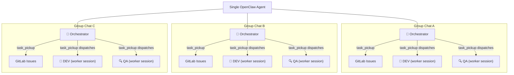
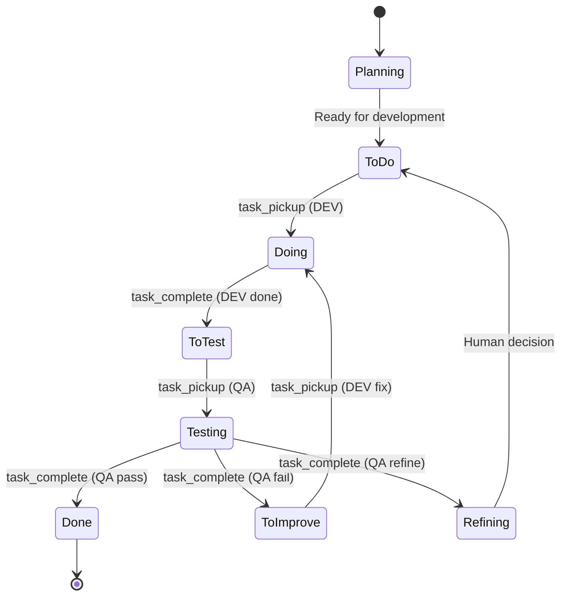
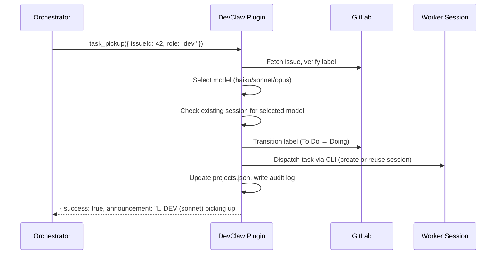

# DevClaw

**Every group chat becomes an autonomous development team.**

Add the agent to a Telegram group, point it at a GitLab repo — that group now has an **orchestrator** managing the backlog, a **DEV** worker session writing code, and a **QA** worker session reviewing it. All autonomous. Add another group, get another team. Each project runs in complete isolation with its own task queue, workers, and session state.

DevClaw is the [OpenClaw](https://openclaw.ai) plugin that makes this work.

## Why

[OpenClaw](https://openclaw.ai) is great at giving AI agents the ability to develop software — spawn worker sessions, manage sessions, work with code. But running a real multi-project development pipeline exposes a gap: the orchestration layer between "agent can write code" and "agent reliably manages multiple projects" is brittle. Every task involves 10+ coordinated steps across GitLab labels, session state, model selection, and audit logging. Agents forget steps, corrupt state, null out session IDs they should preserve, or pick the wrong model for the job.

DevClaw fills that gap with guardrails. It gives the orchestrator atomic tools that make it impossible to forget a label transition, lose a session reference, or skip an audit log entry. The complexity of multi-project orchestration moves from agent instructions (that LLMs follow imperfectly) into deterministic code (that runs the same way every time).

## The idea

One orchestrator agent manages all your projects. It reads task backlogs, creates issues, decides priorities, and delegates work. For each task, DevClaw creates (or reuses) a **DEV** worker session to write code or a **QA** worker session to review it. Every Telegram group is a separate project — the orchestrator keeps them completely isolated while managing them all from a single process.

DevClaw gives the orchestrator four tools that replace hundreds of lines of manual orchestration logic. Instead of following a 10-step checklist per task (fetch issue, check labels, pick model, check for existing session, transition label, dispatch task, update state, log audit event...), it calls `task_pickup` and the plugin handles everything atomically — including session dispatch.

## How it works



It's the same agent process — but each group chat gives it a different project context. The orchestrator role, the workers, the task queue, and all state are fully isolated per group.

## Task lifecycle

Every task (GitLab issue) moves through a fixed pipeline of label states. Issues are created by the orchestrator agent or by worker sessions — not manually. DevClaw tools handle every transition atomically — label change, state update, audit log, and session management in a single call.



## Session reuse

Worker sessions are expensive to start — each new spawn requires the session to read the full codebase (~50K tokens). DevClaw maintains **separate sessions per model per role** (session-per-model design). When a DEV finishes task A and picks up task B on the same project with the same model, the plugin detects the existing session and sends the task directly — no new session needed.

The plugin handles session dispatch internally via OpenClaw CLI. The orchestrator agent never calls `sessions_spawn` or `sessions_send` — it just calls `task_pickup` and the plugin does the rest.



## Model selection

The plugin selects the cheapest model that can handle each task:

| Complexity | Model | When |
|------------|-------|------|
| Simple | Haiku | Typos, CSS, renames, copy changes |
| Standard | Sonnet | Features, bug fixes, multi-file changes |
| Complex | Opus | Architecture, migrations, security, system-wide refactoring |
| QA | Grok | All QA tasks (code review, test validation) |

Selection is based on issue title/description keywords. The orchestrator can override with `modelOverride` on any `task_pickup` call.

## State management

All project state lives in a single `memory/projects.json` file in the orchestrator's workspace, keyed by Telegram group ID:

```json
{
  "projects": {
    "-1234567890": {
      "name": "my-webapp",
      "repo": "~/git/my-webapp",
      "groupName": "Dev - My Webapp",
      "baseBranch": "development",
      "dev": {
        "active": false,
        "issueId": null,
        "model": "haiku",
        "sessions": {
          "haiku": "agent:orchestrator:subagent:a9e4d078-...",
          "sonnet": "agent:orchestrator:subagent:b3f5c912-...",
          "opus": null
        }
      },
      "qa": {
        "active": false,
        "issueId": null,
        "model": "grok",
        "sessions": {
          "grok": "agent:orchestrator:subagent:18707821-..."
        }
      }
    }
  }
}
```

Key design decisions:
- **Session-per-model** — each model gets its own worker session, accumulating context independently. Model selection maps directly to a session key.
- **Sessions preserved on completion** — when a worker completes a task, `sessions` map is **preserved** (only `active` and `issueId` are cleared). This enables session reuse on the next pickup.
- **Plugin-controlled dispatch** — the plugin creates and dispatches to sessions via OpenClaw CLI (`sessions.patch` + `openclaw agent`). The orchestrator agent never calls `sessions_spawn` or `sessions_send`.
- **Sessions persist indefinitely** — no auto-cleanup. `session_health` handles manual cleanup when needed.

All writes go through atomic temp-file-then-rename to prevent corruption.

## Tools

### `task_pickup`

Pick up a task from the GitLab queue for a DEV or QA worker.

**Parameters:**
- `issueId` (number, required) — GitLab issue ID
- `role` ("dev" | "qa", required) — Worker role
- `projectGroupId` (string, required) — Telegram group ID
- `modelOverride` (string, optional) — Force a specific model

**What it does atomically:**
1. Resolves project from `projects.json`
2. Validates no active worker for this role
3. Fetches issue from GitLab, verifies correct label state
4. Selects model based on task complexity
5. Looks up existing session for selected model (session-per-model)
6. Creates session via Gateway RPC if new (`sessions.patch`)
7. Dispatches task to worker session via CLI (`openclaw agent`)
8. Transitions GitLab label (e.g. `To Do` → `Doing`)
9. Updates `projects.json` state (active, issueId, model, session key)
10. Writes audit log entry
11. Returns announcement text for the orchestrator to post

### `task_complete`

Complete a task with one of four results.

**Parameters:**
- `role` ("dev" | "qa", required)
- `result` ("done" | "pass" | "fail" | "refine", required)
- `projectGroupId` (string, required)
- `summary` (string, optional) — For the Telegram announcement

**Results:**
- **DEV "done"** — Pulls latest code, moves label `Doing` → `To Test`, deactivates worker
- **QA "pass"** — Moves label `Testing` → `Done`, closes issue, deactivates worker
- **QA "fail"** — Moves label `Testing` → `To Improve`, reopens issue, prepares DEV fix cycle with model selection
- **QA "refine"** — Moves label `Testing` → `Refining`, awaits human decision

### `queue_status`

Returns task queue counts and worker status across all projects (or a specific one).

**Parameters:**
- `projectGroupId` (string, optional) — Omit for all projects

### `session_health`

Detects and optionally fixes state inconsistencies.

**Parameters:**
- `autoFix` (boolean, optional) — Auto-fix zombies and stale state

**What it does:**
- Queries live sessions via Gateway RPC (`sessions.list`)
- Cross-references with `projects.json` worker state

**Checks:**
- Active worker with no session key (critical)
- Active worker whose session is dead — zombie (critical)
- Worker active for >2 hours (warning)
- Inactive worker with lingering issue ID (warning)

## Audit logging

Every tool call automatically appends an NDJSON entry to `memory/audit.log`. No manual logging required from the orchestrator agent.

```jsonl
{"ts":"2026-02-08T10:30:00Z","event":"task_pickup","project":"my-webapp","issue":42,"role":"dev","model":"sonnet","sessionAction":"send"}
{"ts":"2026-02-08T10:30:01Z","event":"model_selection","issue":42,"role":"dev","selected":"sonnet","reason":"Standard dev task"}
{"ts":"2026-02-08T10:45:00Z","event":"task_complete","project":"my-webapp","issue":42,"role":"dev","result":"done"}
```

## Installation

```bash
# Local (place in extensions directory — auto-discovered)
cp -r devclaw ~/.openclaw/extensions/

# From npm (future)
openclaw plugins install @openclaw/devclaw
```

## Configuration

Optional config in `openclaw.json`:

```json
{
  "plugins": {
    "entries": {
      "devclaw": {
        "config": {
          "glabPath": "/usr/local/bin/glab"
        }
      }
    }
  }
}
```

Restrict tools to your orchestrator agent only:

```json
{
  "agents": {
    "list": [{
      "id": "my-orchestrator",
      "tools": {
        "allow": ["task_pickup", "task_complete", "queue_status", "session_health"]
      }
    }]
  }
}
```

## Requirements

- [OpenClaw](https://openclaw.ai)
- Node.js >= 20
- [`glab`](https://gitlab.com/gitlab-org/cli) CLI installed and authenticated
- A `memory/projects.json` in the orchestrator agent's workspace

## License

MIT
