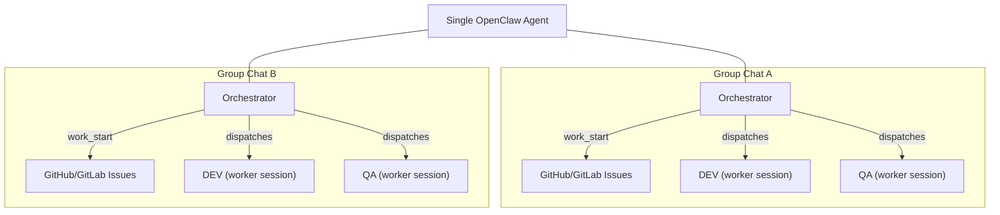
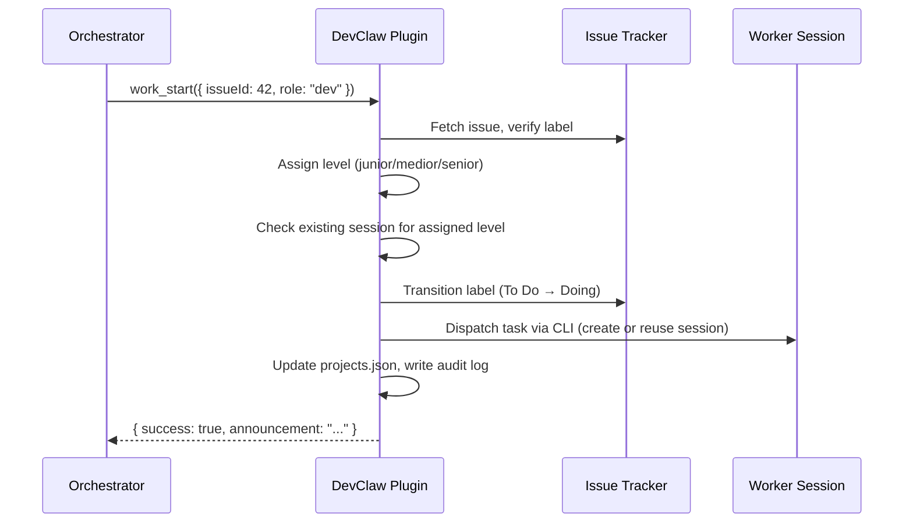

<p align="center">
  
</p>

# DevClaw — Development Plugin for OpenClaw

**Every group chat becomes an autonomous development team.**

Add an agent to a Telegram/WhatsApp group, point it at a GitHub/GitLab repo — that group now has an **orchestrator** managing the backlog, a **DEV** worker writing code, and a **QA** worker reviewing it. All autonomous. Add another group, get another team. Each project runs in complete isolation with its own task queue, workers, and session state.

DevClaw is the [OpenClaw](https://openclaw.ai) plugin that makes this work.

## Benefits

### Process consistency

Every task follows the same fixed pipeline — `Planning → To Do → Doing → To Test → Testing → Done` — across every project. Label transitions, state updates, session dispatch, and audit logging happen atomically inside the plugin. The orchestrator agent **cannot** skip a step, forget a label, or corrupt session state. Hundreds of lines of manual orchestration logic collapse into a single `work_start` call.

### Token savings

DevClaw reduces token consumption at three levels:

| Mechanism | How it works | Estimated savings |
|---|---|---|
| **Shared sessions** | Each developer level per role maintains one persistent session per project. When a medior dev finishes task A and picks up task B, the plugin reuses the existing session — no codebase re-reading. | **~40-60%** per task (~50K tokens saved per session reuse) |
| **Tier selection** | Junior for typos (Haiku), medior for features (Sonnet), senior for architecture (Opus). The right model for the job means you're not burning Opus tokens on a CSS fix. | **~30-50%** on simple tasks vs. always using the largest model |
| **Token-free heartbeat** | The heartbeat service runs every 60s doing health checks and queue dispatch using pure deterministic code + CLI calls. Zero LLM tokens consumed. Workers only use tokens when they actually process tasks. | **100%** savings on orchestration overhead |

### Project isolation and parallelization

Each project is fully isolated — separate task queue, separate worker state, separate sessions. No cross-project contamination. Two execution modes control parallelism:

- **Project-level**: DEV and QA can work simultaneously on different tasks (parallel, default) or one role at a time (sequential)
- **Plugin-level**: Multiple projects can have active workers at once (parallel, default) or only one project active at a time (sequential)

### Continuous planning

The heartbeat service runs a continuous loop: health check → queue scan → dispatch. It detects stale workers (>2 hours), auto-reverts stuck labels, and fills free worker slots — all without human intervention or agent LLM tokens. The orchestrator agent only gets involved when a decision requires judgment.

### Feedback loops

Three automated feedback loops keep the pipeline self-correcting:

1. **Auto-chaining** — DEV "done" automatically dispatches QA. QA "fail" automatically re-dispatches DEV. No orchestrator action needed.
2. **Stale worker watchdog** — Workers active >2 hours are auto-detected. Labels revert to queue, workers deactivated. Tasks available for retry.
3. **Completion enforcement** — Every task message includes a mandatory `work_finish` section. Workers use `"blocked"` if stuck. Three-layer guarantee prevents tasks from getting stuck forever.

### Role-based instruction prompts

Workers receive customizable, project-specific instructions loaded at dispatch time:

```
workspace/projects/roles/
├── my-webapp/
│   ├── dev.md     ← "Run npm test before committing. Deploy URL: ..."
│   └── qa.md      ← "Check OAuth flow. Verify mobile responsiveness."
└── default/
    ├── dev.md     ← Fallback for projects without custom instructions
    └── qa.md
```

Edit these files to inject deployment steps, test commands, acceptance criteria, or coding standards — per project, per role.

### Atomic operations with rollback

Every tool call wraps multiple operations (label transition + state update + session dispatch + audit log) into a single atomic action. If session dispatch fails, the label transition is rolled back. No orphaned state. No half-completed operations.

### Full audit trail

Every tool call automatically appends an NDJSON entry to `log/audit.log`. Query with `jq` to trace any task's full history. No manual logging required from the orchestrator.

---

## The model-to-role mapping

DevClaw doesn't expose raw model names. You're assigning a _junior developer_ to fix a typo, not configuring `anthropic/claude-haiku-4-5`. Each developer level maps to a configurable LLM:

### DEV levels

| Level | Who they are | Default model | Assigns to |
|---|---|---|---|
| `junior` | The intern | `anthropic/claude-haiku-4-5` | Typos, single-file fixes, CSS changes |
| `medior` | The reliable mid-level | `anthropic/claude-sonnet-4-5` | Features, bug fixes, multi-file changes |
| `senior` | The architect | `anthropic/claude-opus-4-5` | Architecture, migrations, system-wide refactoring |

### QA levels

| Level | Who they are | Default model | Assigns to |
|---|---|---|---|
| `reviewer` | The code reviewer | `anthropic/claude-sonnet-4-5` | Code review, test validation, PR inspection |
| `tester` | The QA tester | `anthropic/claude-haiku-4-5` | Manual testing, smoke tests |

The orchestrator LLM evaluates each issue and picks the appropriate level. A keyword-based heuristic in `model-selector.ts` serves as fallback when the orchestrator omits the level. Override which model powers each level in [`openclaw.json`](docs/CONFIGURATION.md#model-tiers).

---

## Task workflow

Every task (issue) moves through a fixed pipeline of label states. DevClaw tools handle every transition atomically.


### The eight state labels

| Label | Color | Meaning |
|---|---|---|
| **Planning** | Blue-grey | Pre-work review — issue exists but not ready for development |
| **To Do** | Blue | Ready for DEV pickup |
| **Doing** | Orange | DEV actively working |
| **To Test** | Cyan | Ready for QA pickup |
| **Testing** | Purple | QA actively reviewing |
| **Done** | Green | Complete — issue closed |
| **To Improve** | Red | QA failed — back to DEV |
| **Refining** | Yellow | Awaiting human decision |

### Worker self-reporting

Workers call `work_finish` directly when they're done — no orchestrator involvement needed for the state transition. Workers can also call `task_create` to file follow-up issues they discover during work.

### Auto-chaining

When a project has auto-chaining enabled:

- **DEV "done"** → QA is dispatched immediately (using the reviewer level)
- **QA "fail"** → DEV fix is dispatched immediately (reuses previous DEV level)
- **QA "pass" / "refine" / "blocked"** → no chaining (pipeline done, needs human input, or returned to queue)
- **DEV "blocked"** → no chaining (returned to queue for retry)

### Completion enforcement

Three layers guarantee tasks never get stuck:

1. **Completion contract** — Every task message includes a mandatory section requiring `work_finish`, even on failure. Workers use `"blocked"` if stuck.
2. **Blocked result** — Both DEV and QA can gracefully put a task back in queue (`Doing → To Do`, `Testing → To Test`).
3. **Stale worker watchdog** — Heartbeat detects workers active >2 hours and auto-reverts labels to queue.

---

## Installation

### Requirements

| Requirement | Why | Verify |
|---|---|---|
| [OpenClaw](https://openclaw.ai) | DevClaw is an OpenClaw plugin | `openclaw --version` |
| Node.js >= 20 | Plugin runtime | `node --version` |
| [`gh`](https://cli.github.com) or [`glab`](https://gitlab.com/gitlab-org/cli) CLI | Issue tracker provider (auto-detected from git remote) | `gh --version` / `glab --version` |
| CLI authenticated | Plugin calls gh/glab for every label transition | `gh auth status` / `glab auth status` |

### Install the plugin

```bash
cp -r devclaw ~/.openclaw/extensions/
```

Verify:

```bash
openclaw plugins list
# Should show: DevClaw | devclaw | loaded
```

### Run setup

Three options — pick one:

**Option A: Conversational onboarding (recommended)**

Call the `onboard` tool from any agent with DevClaw loaded. It walks through configuration step by step.

**Option B: CLI wizard**

```bash
openclaw devclaw setup
```

**Option C: Non-interactive CLI**

```bash
openclaw devclaw setup --new-agent "My Orchestrator"
```

Setup creates an agent, configures model tiers, writes workspace files (AGENTS.md, HEARTBEAT.md, role templates), and optionally binds a messaging channel.

### Register a project

In the Telegram/WhatsApp group for the project:

> "Register project my-app at ~/git/my-app with base branch main"

The agent calls `project_register`, which atomically creates all 8 state labels, scaffolds role instruction files, and adds the project to `projects.json`.

### Start working

```
"Check the queue"           → agent calls status
"Pick up issue #1 for DEV"  → agent calls work_start
[DEV works autonomously]    → calls work_finish when done
[Heartbeat fills next slot] → QA dispatched automatically
```

See the [Onboarding Guide](docs/ONBOARDING.md) for detailed step-by-step instructions.

---

## How it works



Same agent process — each group chat gives it a different project context. The orchestrator role, the workers, the task queue, and all state are fully isolated per group.

---

## Session reuse

Worker sessions are expensive to start — each new spawn reads the full codebase (~50K tokens). DevClaw maintains **separate sessions per level per role** (session-per-level design). When a medior dev finishes task A and picks up task B on the same project, the plugin detects the existing session and sends the task directly.

The plugin handles session dispatch internally via OpenClaw CLI. The orchestrator agent never calls `sessions_spawn` or `sessions_send` — it calls `work_start` and the plugin does the rest.



---

## Tools

DevClaw registers **11 tools**, grouped by function:

### Worker lifecycle

| Tool | Description |
|---|---|
| [`work_start`](docs/TOOLS.md#work_start) | Pick up a task — handles level assignment, label transition, session dispatch, audit |
| [`work_finish`](docs/TOOLS.md#work_finish) | Complete a task — handles label transition, state update, auto-chaining, queue tick |

### Task management

| Tool | Description |
|---|---|
| [`task_create`](docs/TOOLS.md#task_create) | Create a new issue in the tracker |
| [`task_update`](docs/TOOLS.md#task_update) | Change an issue's state label manually |
| [`task_comment`](docs/TOOLS.md#task_comment) | Add a comment to an issue |

### Operations

| Tool | Description |
|---|---|
| [`status`](docs/TOOLS.md#status) | Queue counts + worker state dashboard |
| [`health`](docs/TOOLS.md#health) | Worker health checks + zombie detection |
| [`work_heartbeat`](docs/TOOLS.md#work_heartbeat) | Manual trigger for health + queue dispatch |

### Setup

| Tool | Description |
|---|---|
| [`project_register`](docs/TOOLS.md#project_register) | One-time project setup (labels, prompts, state) |
| [`setup`](docs/TOOLS.md#setup) | Agent + workspace initialization |
| [`onboard`](docs/TOOLS.md#onboard) | Conversational onboarding guide |

See the [Tools Reference](docs/TOOLS.md) for full parameters and usage.

---

## Documentation

| Document | Description |
|---|---|
| [Architecture](docs/ARCHITECTURE.md) | System design, session-per-level model, data flow, component interactions |
| [Tools Reference](docs/TOOLS.md) | Complete reference for all 11 tools with parameters and examples |
| [Configuration](docs/CONFIGURATION.md) | Full config reference — `openclaw.json`, `projects.json`, heartbeat, notifications |
| [Onboarding Guide](docs/ONBOARDING.md) | Step-by-step setup: install, configure, register projects, test the pipeline |
| [QA Workflow](docs/QA_WORKFLOW.md) | QA process: review documentation, comment templates, enforcement |
| [Context Awareness](docs/CONTEXT-AWARENESS.md) | How DevClaw adapts behavior based on interaction context |
| [Testing Guide](docs/TESTING.md) | Automated test suite: scenarios, fixtures, CI/CD integration |
| [Management Theory](docs/MANAGEMENT.md) | The delegation theory behind DevClaw's design |
| [Roadmap](docs/ROADMAP.md) | Planned features: configurable roles, channel-agnostic groups, Jira |

---

## License

MIT
