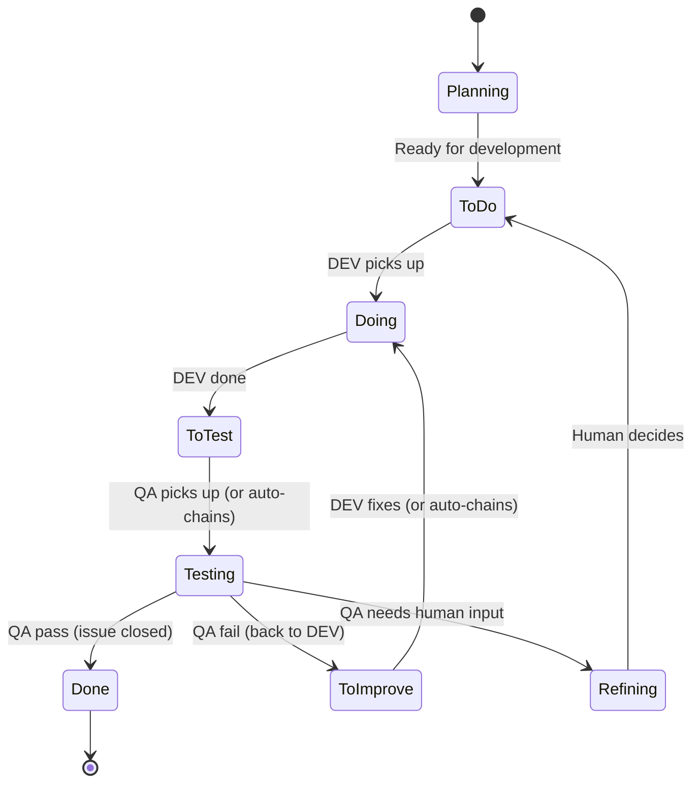

<p align="center">
  
</p>

# DevClaw

**Turn any group chat into a dev team that ships.**

DevClaw is a plugin for [OpenClaw](https://openclaw.ai) that turns your orchestrator agent into a development manager. It hires developers, assigns tasks, reviews code, and keeps the pipeline moving — across as many projects as you have group chats.

---

## What it looks like

Add your OpenClaw agent to a Telegram group. Register a project. That's it — you now have a dev team:

```
You:    "Check the queue"
Agent:  "3 issues in To Do. DEV is idle. QA is idle."

You:    "Pick up #42 for DEV"
Agent:  "⚡ Sending DEV (medior) for #42: Add login page"
        (a Sonnet session opens, reads the repo, starts coding)

        ... 10 minutes later ...

Agent:  "✅ DEV DONE #42 — Login page with OAuth. Moved to QA."
        (a reviewer session opens automatically, starts reviewing)

        ... 5 minutes later ...

Agent:  "🎉 QA PASS #42. Issue closed."
```

No configuration between those steps. No manual handoff. The developer finished, QA started automatically, the issue closed itself. You watched it happen in your group chat.

Add another group → another project. Same agent, fully isolated teams.

---

## The problem DevClaw solves

OpenClaw is a great multi-agent runtime. It handles sessions, tools, channels, gateway RPC — everything you need to run AI agents. But it's a general-purpose platform. It has no opinion about how software gets built.

Without DevClaw, your orchestrator agent has to figure out on its own how to:
- Pick the right model for the task complexity
- Create or reuse the right worker session
- Transition issue labels in the right order
- Track which worker is doing what across projects
- Chain DEV completion into QA review
- Detect crashed workers and recover
- Log everything for auditability

That's a lot of reasoning per task. LLMs do it imperfectly — they forget steps, corrupt state, pick the wrong model, lose session references. You end up babysitting the thing you built to avoid babysitting.

DevClaw moves all of that into deterministic plugin code. The agent says "pick up issue #42." The plugin handles the other 10 steps atomically. Every time, the same way, zero reasoning tokens spent on orchestration.

---

## Meet your team

DevClaw doesn't think in model IDs. It thinks in people.

When a task comes in, you don't configure `anthropic/claude-sonnet-4-5` — you assign a **medior developer**. The orchestrator evaluates task complexity and picks the right person for the job:

### Developers

| Who | What they do | Under the hood |
|---|---|---|
| **Junior** | Typos, CSS fixes, renames, single-file changes | Haiku |
| **Medior** | Features, bug fixes, multi-file changes | Sonnet |
| **Senior** | Architecture, migrations, system-wide refactoring | Opus |

### QA

| Who | What they do | Under the hood |
|---|---|---|
| **Reviewer** | Code review, test validation, PR inspection | Sonnet |
| **Tester** | Manual testing, smoke tests | Haiku |

A CSS typo gets the intern. A database migration gets the architect. You're not burning Opus tokens on a color change, and you're not sending Haiku to redesign your auth system.

Every mapping is [configurable](docs/CONFIGURATION.md#model-tiers) — swap in any model you want per level.

---

## How a task moves through the pipeline

Every issue follows the same path, no exceptions. DevClaw enforces it:

```
Planning → To Do → Doing → To Test → Testing → Done
```



These labels live on your actual GitHub/GitLab issues. Not in some internal database — in the tool you already use. Filter by `Doing` in GitHub to see what's in progress. Set up a webhook on `Done` to trigger deploys. The issue tracker is the source of truth.

### What "atomic" means here

When you say "pick up #42 for DEV", the plugin does all of this in one operation:
1. Verifies the issue is in the right state
2. Picks the developer level (or uses what you specified)
3. Transitions the label (`To Do` → `Doing`)
4. Creates or reuses the right worker session
5. Dispatches the task with project-specific instructions
6. Updates internal state
7. Logs an audit entry

If step 4 fails, step 3 is rolled back. No half-states, no orphaned labels, no "the issue says Doing but nobody's working on it."

---

## What happens behind the scenes

### Workers report back themselves

When a developer finishes, they call `work_finish` directly — no orchestrator involved:

- **DEV "done"** → label moves to `To Test`, QA starts automatically
- **DEV "blocked"** → label moves back to `To Do`, task returns to queue
- **QA "pass"** → label moves to `Done`, issue closes
- **QA "fail"** → label moves to `To Improve`, DEV gets re-dispatched

The orchestrator doesn't need to poll, check, or coordinate. Workers are self-reporting.

### Sessions accumulate context

Each developer level gets its own persistent session per project. Your medior dev that's done 5 features on `my-app` already knows the codebase — it doesn't re-read 50K tokens of source code every time it picks up a new task.

That's a **~40-60% token saving per task** from session reuse alone.

Combined with tier selection (not using Opus when Haiku will do) and the token-free heartbeat (more on that next), DevClaw significantly reduces your token bill versus running everything through one large model.

### The heartbeat runs for free

Every 60 seconds, a background service:
- Checks if any workers have been stuck for >2 hours (reverts them)
- Scans the queue for available tasks
- Dispatches workers to fill empty slots

All of this is deterministic code — CLI calls and JSON reads. Zero LLM tokens. Workers only consume tokens when they're actually writing code or reviewing PRs.

### Everything is logged

Every tool call writes an NDJSON line to `audit.log`:

```bash
cat audit.log | jq 'select(.event=="work_start")'
```

Full trace of every task, every level selection, every label transition, every health fix. No manual logging needed.

---

## Your issues, your tracker

DevClaw doesn't replace your issue tracker — it uses it. All task state lives in GitHub Issues or GitLab Issues (auto-detected from your git remote). The eight pipeline labels are created on your repo when you register a project.

The abstraction layer (`IssueProvider`) is pluggable. GitHub and GitLab work today. Jira, Linear, or anything else just needs to implement the same interface.

This means:
- Your project manager sees task progress in GitHub/GitLab without knowing DevClaw exists
- Your CI/CD can trigger on label changes
- Your existing dashboards and filters keep working
- If you stop using DevClaw, your issues and labels stay exactly where they are

---

## Custom instructions per project

Each project gets its own instruction files that workers receive with every task:

```
workspace/projects/roles/
├── my-webapp/
│   ├── dev.md     "Run npm test before committing. Deploy URL: staging.example.com"
│   └── qa.md      "Check OAuth flow. Verify mobile responsiveness."
├── my-api/
│   ├── dev.md     "Run cargo test. Follow REST conventions in CONTRIBUTING.md"
│   └── qa.md      "Verify all endpoints return correct status codes."
└── default/
    ├── dev.md     (fallback for projects without custom instructions)
    └── qa.md
```

Deployment steps, test commands, coding standards, acceptance criteria — all injected automatically at dispatch time.

---

## Getting started

### Prerequisites

- [OpenClaw](https://openclaw.ai) installed (`openclaw --version`)
- Node.js >= 20
- `gh` CLI ([GitHub](https://cli.github.com)) or `glab` CLI ([GitLab](https://gitlab.com/gitlab-org/cli)), authenticated

### Install

```bash
cp -r devclaw ~/.openclaw/extensions/
```

### Set up through conversation

The easiest way to configure DevClaw is to just talk to your agent:

```
You:   "Help me set up DevClaw"
Agent: "I'll walk you through it. Should I use this agent as the
        orchestrator, or create a new one?"
You:   "Use this one"

Agent: "Want to bind a messaging channel?"
You:   "Telegram"

Agent: "Here are the default developer assignments:
        Junior → Haiku, Medior → Sonnet, Senior → Opus
        Reviewer → Sonnet, Tester → Haiku
        Keep these or customize?"
You:   "Keep them"

Agent: "Done. Want to register a project?"
You:   "Yes — my-app at ~/git/my-app, main branch"

Agent: "Project registered. 8 labels created on your repo.
        Role instructions scaffolded. Try: 'check the queue'"
```

You can also use the [CLI wizard or non-interactive setup](docs/ONBOARDING.md#step-2-run-setup) for scripted environments.

---

## The toolbox

DevClaw gives the orchestrator 11 tools. These aren't just convenience wrappers — they're **guardrails**. Each tool encodes a complex multi-step operation into a single atomic call. The agent provides intent, the plugin handles mechanics. The agent physically cannot skip a label transition, forget to update state, or dispatch to the wrong session — those decisions are made by deterministic code, not LLM reasoning.

| Tool | What it does |
|---|---|
| `work_start` | Pick up a task — resolves level, transitions label, dispatches session, logs audit |
| `work_finish` | Complete a task — transitions label, updates state, auto-chains next step, ticks queue |
| `task_create` | Create a new issue (used by workers to file bugs they discover) |
| `task_update` | Manually change an issue's state label |
| `task_comment` | Add a comment to an issue (with role attribution) |
| `status` | Dashboard: queue counts + who's working on what |
| `health` | Detect zombie workers, stale sessions, state inconsistencies |
| `work_heartbeat` | Manually trigger a health check + queue dispatch cycle |
| `project_register` | One-time project setup: creates labels, scaffolds instructions, initializes state |
| `setup` | Agent + workspace initialization |
| `onboard` | Conversational setup guide |

Full parameters and usage in the [Tools Reference](docs/TOOLS.md).

---

## Parallel everything

Each project is fully isolated — its own queue, workers, sessions, and state. No cross-project contamination.

Two execution modes:
- **Project-level** — DEV and QA work simultaneously on different tasks (default) or take turns
- **Plugin-level** — all projects run in parallel (default) or one at a time

One agent, many groups, many projects, all at once.

---

## Documentation

| | |
|---|---|
| **[Architecture](docs/ARCHITECTURE.md)** | System design, session model, data flow, end-to-end diagrams |
| **[Tools Reference](docs/TOOLS.md)** | Complete reference for all 11 tools |
| **[Configuration](docs/CONFIGURATION.md)** | `openclaw.json`, `projects.json`, heartbeat, notifications |
| **[Onboarding Guide](docs/ONBOARDING.md)** | Full step-by-step setup |
| **[QA Workflow](docs/QA_WORKFLOW.md)** | QA process and review templates |
| **[Context Awareness](docs/CONTEXT-AWARENESS.md)** | How tools adapt to group vs. DM vs. agent context |
| **[Testing](docs/TESTING.md)** | Test suite, fixtures, CI/CD |
| **[Management Theory](docs/MANAGEMENT.md)** | The delegation model behind the design |
| **[Roadmap](docs/ROADMAP.md)** | What's coming next |

---

## License

MIT
