# DevClaw — Architecture & Component Interaction

## Agents vs Sessions

Understanding the OpenClaw model is key to understanding how DevClaw works:

- **Agent** — A configured entity in `openclaw.json`. Has a workspace, model, identity files (SOUL.md, IDENTITY.md), and tool permissions. Persists across restarts.
- **Session** — A runtime conversation instance. Each session has its own context window and conversation history, stored as a `.jsonl` transcript file.
- **Sub-agent session** — A session created under the orchestrator agent for a specific worker role. NOT a separate agent — it's a child session running under the same agent, with its own isolated context. Format: `agent:<parent>:subagent:<uuid>`.

### Session-per-model design

Each project maintains **separate sessions per model per role**. A project's DEV might have a Haiku session, a Sonnet session, and an Opus session — each accumulating its own codebase context over time.

```
Orchestrator Agent (configured in openclaw.json)
  └─ Main session (long-lived, handles all projects)
       │
       ├─ Project A
       │    ├─ DEV sessions: { haiku: <uuid>, sonnet: <uuid>, opus: null }
       │    └─ QA sessions:  { grok: <uuid> }
       │
       └─ Project B
            ├─ DEV sessions: { haiku: null, sonnet: <uuid>, opus: null }
            └─ QA sessions:  { grok: <uuid> }
```

Why per-model instead of switching models on one session:
- **No model switching overhead** — each session always uses the same model
- **Accumulated context** — a Haiku session that's done 20 typo fixes knows the project well; a Sonnet session that's done 5 features knows it differently
- **No cross-model confusion** — conversation history stays with the model that generated it
- **Deterministic reuse** — model selection directly maps to a session key, no patching needed

### Plugin-controlled session lifecycle

DevClaw controls the full session lifecycle — the orchestrator agent does NOT call `sessions_spawn` or `sessions_send` directly. Instead, the plugin uses the OpenClaw Gateway RPC and CLI to manage sessions deterministically:

```
Plugin control path:
  1. sessions.patch (Gateway RPC) → create session entry + set model
  2. openclaw agent (CLI)         → send message to session
```

This moves session management from brittle agent instructions into deterministic plugin code.

## System overview


## End-to-end flow: human to sub-agent

This diagram shows the complete path from a human message in Telegram through to a sub-agent session working on code:

```mermaid
sequenceDiagram
    participant H as Human (Telegram)
    participant TG as Telegram Channel
    participant MS as Main Session<br/>(orchestrator)
    participant DC as DevClaw Plugin
    participant GW as Gateway RPC
    participant CLI as openclaw agent CLI
    participant DEV as DEV Sub-agent<br/>Session (sonnet)
    participant GL as GitLab

    Note over H,GL: Issue exists in queue (To Do)

    H->>TG: "check status" (or heartbeat triggers)
    TG->>MS: delivers message
    MS->>DC: queue_status()
    DC->>GL: glab issue list --label "To Do"
    DC-->>MS: { toDo: [#42], dev: idle }

    Note over MS: Decides to pick up #42 for DEV

    MS->>DC: task_pickup({ issueId: 42, role: "dev", ... })
    DC->>DC: selectModel → "sonnet"
    DC->>DC: lookup dev.sessions.sonnet → null (first time)
    DC->>DC: generate new UUID
    DC->>GL: glab issue update 42 --unlabel "To Do" --label "Doing"
    DC->>DC: update projects.json (active, issueId, model)
    DC->>GW: sessions.patch({ key: "...subagent:<uuid>", model: "anthropic/claude-sonnet-4-5" })
    GW-->>DC: { ok: true }
    DC->>CLI: openclaw agent --agent orchestrator --session-id <uuid> --message "Build login page for #42..."
    CLI->>DEV: creates session, sends task
    DC->>DC: store UUID in dev.sessions.sonnet
    DC->>DC: append audit.log
    DC-->>MS: { success: true, announcement: "🔧 Spawning DEV (sonnet) for #42" }

    MS->>TG: "🔧 Spawning DEV (sonnet) for #42: Add login page"
    TG->>H: sees announcement

    Note over DEV: Works autonomously — reads code, writes code, creates MR

    DEV-->>MS: "done, MR merged"
    MS->>DC: task_complete({ role: "dev", result: "done", ... })
    DC->>GL: glab issue update 42 --unlabel "Doing" --label "To Test"
    DC->>DC: deactivate worker (sessions preserved)
    DC-->>MS: { announcement: "✅ DEV done #42" }

    MS->>TG: "✅ DEV done #42 — moved to QA queue"
    TG->>H: sees announcement
```



On the **next DEV task** for this project that also selects Sonnet:

```mermaid
sequenceDiagram
    participant MS as Main Session
    participant DC as DevClaw Plugin
    participant CLI as openclaw agent CLI
    participant DEV as DEV Session<br/>(sonnet, existing)

    MS->>DC: task_pickup({ issueId: 57, role: "dev", ... })
    DC->>DC: selectModel → "sonnet"
    DC->>DC: lookup dev.sessions.sonnet → <uuid> (exists!)
    Note over DC: No sessions.patch needed — model already set
    DC->>CLI: openclaw agent --session-id <uuid> --message "Fix validation for #57..."
    CLI->>DEV: sends to existing session (has full codebase context)
    DC-->>MS: { success: true, announcement: "⚡ Sending DEV (sonnet) for #57" }
```



Session reuse saves ~50K tokens per task by not re-reading the codebase.

## Complete ticket lifecycle

This traces a single issue from creation to completion, showing every component interaction, data write, and message.

### Phase 1: Issue created

Issues are created by the orchestrator agent or by sub-agent sessions via `glab`. The orchestrator can create issues based on user requests in Telegram, backlog planning, or QA feedback. Sub-agents can also create issues when they discover bugs or related work during development.

```
Orchestrator Agent → GitLab: creates issue #42 with label "To Do"
```

**State:** GitLab has issue #42 labeled "To Do". Nothing in DevClaw yet.

### Phase 2: Heartbeat detects work

```
Heartbeat triggers → Orchestrator calls queue_status()
```


**Orchestrator decides:** DEV is idle, issue #42 is in To Do → pick it up.

### Phase 3: DEV pickup

The plugin handles everything — model selection, session management, label transition, state update, and dispatching the task to the correct sub-agent session.


**Writes:**
- `GitLab`: label "To Do" → "Doing"
- `projects.json`: dev.active=true, dev.issueId="42", dev.model="sonnet", dev.sessions.sonnet=uuid
- `audit.log`: 2 entries (task_pickup, model_selection)
- `Gateway`: session entry created/reused
- `Sub-agent`: task message delivered

### Phase 4: DEV works

```
DEV sub-agent session → reads codebase, writes code, creates MR
DEV sub-agent session → reports back to orchestrator: "done, MR merged"
```

This happens inside the OpenClaw session. DevClaw is not involved — the DEV sub-agent session works autonomously with the codebase.

### Phase 5: DEV complete


**Writes:**
- `Git repo`: pulled latest (has DEV's merged code)
- `projects.json`: dev.active=false, dev.issueId=null (sessions map preserved for reuse)
- `GitLab`: label "Doing" → "To Test"
- `audit.log`: 1 entry (task_complete)

### Phase 6: QA pickup

Same as Phase 3, but with `role: "qa"`. Label transitions "To Test" → "Testing". Model defaults to Grok for QA.

### Phase 7: QA result (3 possible outcomes)

#### 7a. QA Pass

```mermaid
sequenceDiagram
    participant A as Orchestrator
    participant TC as task_complete
    participant GL as GitLab
    participant PJ as projects.json
    participant AL as audit.log

    A->>TC: task_complete({ role: "qa", result: "pass", projectGroupId: "-123" })
    TC->>PJ: deactivateWorker(-123, qa)
    TC->>GL: glab issue update 42 --unlabel "Testing" --label "Done"
    TC->>GL: glab issue close 42
    TC->>AL: append { event: "task_complete", role: "qa", result: "pass" }
    TC-->>A: { announcement: "🎉 QA PASS #42. Issue closed." }
```



**Ticket complete.** Issue closed, label "Done".

#### 7b. QA Fail


**Cycle restarts:** Issue goes to "To Improve". Next heartbeat, DEV picks it up again (Phase 3, but from "To Improve" instead of "To Do").

#### 7c. QA Refine

```
Label: "Testing" → "Refining"
```

Issue needs human decision. Pipeline pauses until human moves it to "To Do" or closes it.

### Phase 8: Heartbeat (continuous)

The heartbeat runs periodically (triggered by the agent or a scheduled message). It combines health check + queue scan:


## Data flow map

Every piece of data and where it lives:

```
┌─────────────────────────────────────────────────────────────────┐
│ GitLab (source of truth for tasks)                              │
│                                                                 │
│  Issue #42: "Add login page"                                    │
│  Labels: [To Do | Doing | To Test | Testing | Done | ...]       │
│  State: open / closed                                           │
│  MRs: linked merge requests                                    │
│  Created by: orchestrator agent, DEV/QA sub-agents, or humans  │
└─────────────────────────────────────────────────────────────────┘
        ↕ glab CLI (read/write)
┌─────────────────────────────────────────────────────────────────┐
│ DevClaw Plugin (orchestration logic)                            │
│                                                                 │
│  task_pickup    → model select + session manage + label + state │
│  task_complete  → label transition + state update + git pull    │
│  queue_status   → read labels + read state                     │
│  session_health → check sessions via gateway + fix zombies     │
└─────────────────────────────────────────────────────────────────┘
        ↕ atomic file I/O          ↕ Gateway RPC / CLI
┌────────────────────────────────┐ ┌──────────────────────────────┐
│ memory/projects.json           │ │ OpenClaw Gateway             │
│                                │ │                              │
│  Per project:                  │ │  sessions.patch → set model  │
│    dev:                        │ │  sessions.list  → list alive │
│      active, issueId, model    │ │  sessions.delete → cleanup   │
│      sessions:                 │ │                              │
│        haiku: <uuid>           │ │  openclaw agent CLI          │
│        sonnet: <uuid>          │ │  → send message to session   │
│        opus: <uuid>            │ │  → creates session if new    │
│    qa:                         │ │                              │
│      active, issueId, model    │ └──────────────────────────────┘
│      sessions:                 │
│        grok: <uuid>            │
└────────────────────────────────┘
        ↕ append-only
┌─────────────────────────────────────────────────────────────────┐
│ memory/audit.log (observability)                                │
│                                                                 │
│  NDJSON, one line per event:                                    │
│  task_pickup, task_complete, model_selection,                   │
│  queue_status, health_check, session_spawn, session_reuse       │
│                                                                 │
│  Query with: cat audit.log | jq 'select(.event=="task_pickup")' │
└─────────────────────────────────────────────────────────────────┘

┌─────────────────────────────────────────────────────────────────┐
│ Telegram (user-facing messages)                                 │
│                                                                 │
│  Per group chat:                                                │
│    "🔧 Spawning DEV (sonnet) for #42: Add login page"           │
│    "⚡ Sending DEV (sonnet) for #57: Fix validation"            │
│    "✅ DEV done #42 — Login page with OAuth. Moved to QA queue."│
│    "🎉 QA PASS #42. Issue closed."                              │
│    "❌ QA FAIL #42 — OAuth redirect broken. Sent back to DEV."  │
└─────────────────────────────────────────────────────────────────┘

┌─────────────────────────────────────────────────────────────────┐
│ Git Repository (codebase)                                       │
│                                                                 │
│  DEV sub-agent sessions: read code, write code, create MRs      │
│  QA sub-agent sessions: read code, run tests, review MRs        │
│  task_complete (DEV done): git pull to sync latest               │
└─────────────────────────────────────────────────────────────────┘
```

## Scope boundaries

What DevClaw controls vs. what it delegates:


## Error recovery

| Failure | Detection | Recovery |
|---|---|---|
| Session dies mid-task | `session_health` checks via `sessions.list` gateway RPC | `autoFix`: reverts label, clears active state, removes dead session from sessions map. Next heartbeat picks up task again (spawns fresh session for that model). |
| glab command fails | Tool throws error, returns to agent | Agent retries or reports to Telegram group |
| Gateway RPC fails | `sessions.patch` or `openclaw agent` returns error | Tool returns error to orchestrator with details. Agent can retry or report. |
| projects.json corrupted | Tool can't parse JSON | Manual fix needed. Atomic writes (temp+rename) prevent partial writes. |
| Label out of sync | `task_pickup` verifies label before transitioning | Throws error if label doesn't match expected state. Agent reports mismatch. |
| Worker already active | `task_pickup` checks `active` flag | Throws error: "DEV worker already active on project". Must complete current task first. |
| Stale worker (>2h) | `session_health` flags as warning | Agent can investigate or `autoFix` can clear. |

## File locations

| File | Location | Purpose |
|---|---|---|
| Plugin source | `~/.openclaw/extensions/devclaw/` | Plugin code |
| Plugin manifest | `~/.openclaw/extensions/devclaw/openclaw.plugin.json` | Plugin registration |
| Agent config | `~/.openclaw/openclaw.json` | Agent definition + tool permissions |
| Worker state | `~/.openclaw/workspace-<agent>/memory/projects.json` | Per-project DEV/QA state |
| Audit log | `~/.openclaw/workspace-<agent>/memory/audit.log` | NDJSON event log |
| Session transcripts | `~/.openclaw/agents/<agent>/sessions/<uuid>.jsonl` | Conversation history per session |
| Git repos | `~/git/<project>/` | Project source code |
